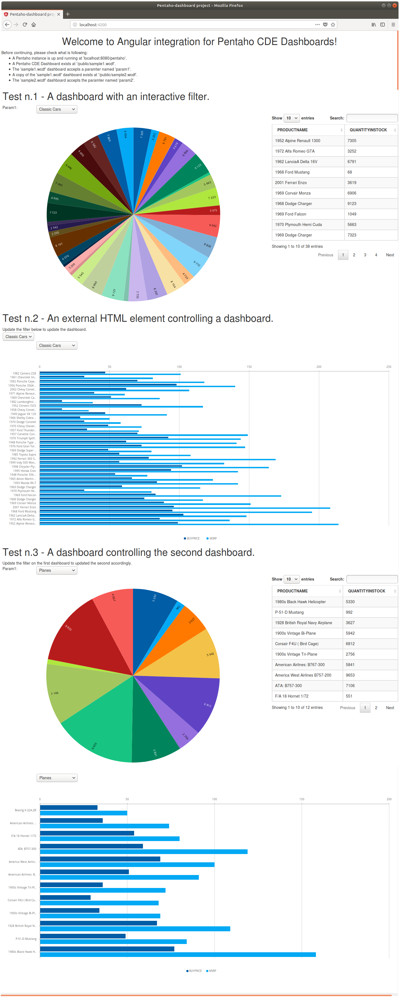

# Pentaho-dashboard package

This project contains the Angular JS integration for Pentaho Dashboards.

The project is tested in a generic Angular application but also to be used together with the [Alfresco Application Development Framework](https://github.com/Alfresco/alfresco-ng2-components) components.

For a complete documentation check the GitBook at the following [link](https://www.gitbook.com/book/fcorti/pentaho-dashboard-project).

## Screenshot

## Content of the package

The package contains:

* The `pentaho-dashboard` component, used to render a Pentaho CDE dashboard in an Angular page. The `pentaho-dashboard` component uses the `pentaho-dashboard` services.
* The `pentaho-dashboard` services, used as library to collect all the available services useful for the package.
